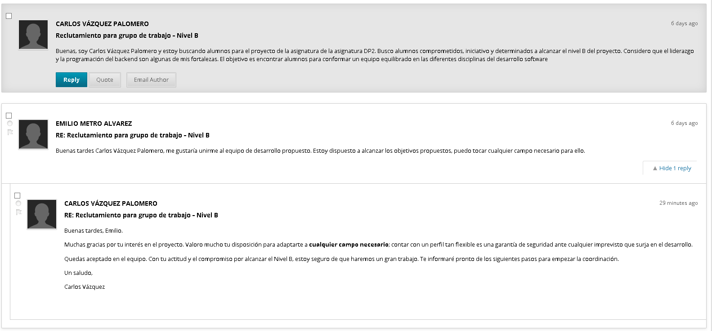
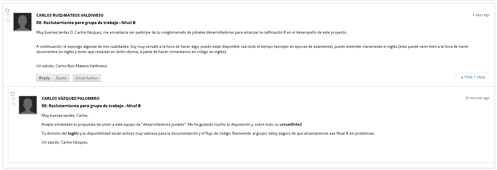

# Chartering Report: Project Acme-Starters-C

**Date:** 16/02/2026

---

## Table of Contents
- [Chartering Report: Project Acme-Starters-C](#chartering-report-project-acme-starters-c)
  - [Table of Contents](#table-of-contents)
  - [1. Executive Summary](#1-executive-summary)
  - [2. Revision Table](#2-revision-table)
  - [3. Introduction](#3-introduction)
  - [4. Training Process](#4-training-process)
  - [5. Commitment and Objectives Statement](#5-commitment-and-objectives-statement)
  - [6. Performance Indicators (KPIs)](#6-performance-indicators-kpis)
    - [Performance Definition](#performance-definition)
  - [7. Performance Management and Group Exit](#7-performance-management-and-group-exit)
    - [7.1. Rewards and Sanctions]
    - [7.2. Expulsion Conditions]
  - [8. Conclusions](#8-conclusions)
  - [9. Bibliography](#9-bibliography)

---

## 1. Executive Summary
Este informe detalla la constitución y las normas de gobernanza del equipo de trabajo para la asignatura Diseño y Pruebas II (DP2). Se describe el proceso de reclutamiento formal realizado a través de los canales oficiales, los compromisos de calidad adquiridos para alcanzar el Nivel B, y el sistema de indicadores de rendimiento que regulará la colaboración. Asimismo, se establecen las políticas de recompensa, amonestación y expulsión para garantizar el éxito del proyecto.

## 2. Revision Table
| Revision | Date | Description |
| :--- | :--- | :--- |
| v1.0 | 14/02/2026 | Initial version of the Chartering Report. |

## 3. Introduction
El presente documento tiene como objetivo formalizar la estructura operativa del equipo de trabajo asignado al proyecto Acme-Starters-C. El reporte sirve como marco de referencia para el comportamiento esperado, la medición del desempeño individual y los mecanismos de resolución de conflictos durante el cuatrimestre.

El documento se estructura de la siguiente manera: primero, se detalla el proceso de formación; segundo, se exponen los compromisos y objetivos del grupo; tercero, se definen los indicadores de rendimiento; y finalmente, se establecen las políticas de gestión de personal y las conclusiones generales.

---

## 4. Training Process
La formación del equipo se llevó a cabo de manera formal mediante la herramienta oficial de comunicación de la asignatura (Enseñanza Virtual). El proceso comenzó con la apertura de un hilo titulado "Reclutamiento para grupo de trabajo – Nivel B", iniciado por **Student 1**.

A través de dicho hilo, los integrantes manifestaron voluntariamente su interés en formar parte del grupo. Tras valorar la disponibilidad, el compromiso con el objetivo de calidad y la afinidad en la forma de trabajo, se procedió al cierre del equipo con los cinco miembros actuales. La constitución se realizó de forma consensuada dentro de los plazos establecidos por la asignatura.

## 5. Commitment and Objectives Statement
Los miembros del grupo declaran formalmente su compromiso de trabajar conjuntamente en la asignatura. Manifestamos haber leído y comprendido en su totalidad el syllabus de la asignatura, con especial énfasis en los procedimientos de evaluación y calificación. Nuestro objetivo de calidad es la obtención del Nivel B.

## 6. Performance Indicators (KPIs)
Para evaluar el desempeño de los integrantes, utilizaremos los siguientes indicadores:
* **Cumplimiento de Plazos (CP):** Porcentaje de tareas entregadas en la fecha acordada internamente.
* **Calidad del Trabajo (CT):** Valoración de los compañeros en las revisiones de código o documentos (escala 1-5). Se realizará una evaluación semanal.
* **Participación (P):** Asistencia a reuniones semanales y respuesta a comunicaciones en menos de 24h.

### Performance Definition
* **Rendimiento Positivo:** Un miembro rinde bien si mantiene un $CP > 90\%$, una $CT \text{ media} > 4$ y asiste a todas las reuniones programadas.
* **Rendimiento Negativo:** Se considera rendimiento deficiente si el $CP < 70\%$, si la $CT \text{ media}$ es $< 3$ (requiriendo que otros miembros rehagan su trabajo) o si falta a dos reuniones sin justificación.

---

## 7. Performance Management and Group Exit

### 7.1. Rewards and Sanctions
* **Recompensas:** Los miembros con rendimiento positivo constante tendrán prioridad en la elección de tareas en los siguientes sprints.
* **Amonestaciones:** Ante un rendimiento negativo, se realizará un primer aviso verbal de advertencia. Si la actitud persiste, se enviará una amonestación formal por escrito vía correo electrónico o canal oficial del equipo.

### 7.2. Expulsion Conditions
Un miembro del equipo podrá ser expulsado bajo las siguientes condiciones:
1.  Acumular dos amonestaciones formales por escrito sin mejora demostrada.
2.  Inactividad total (falta de comunicación y entrega) durante una fase completa del proyecto (Sprint).
3.  Comportamiento que atente contra la ética del grupo o el progreso del proyecto, como por ejemplo el plagio o cambio de código de otros integrantes.

## 8. Conclusions
El equipo ha establecido una base sólida para la colaboración, priorizando la transparencia y la responsabilidad individual. La definición clara de KPIs y políticas de salida asegura que todos los miembros compartan la misma visión de excelencia necesaria para alcanzar los objetivos académicos propuestos.

## 9. Bibliography
Intentionally blank.
